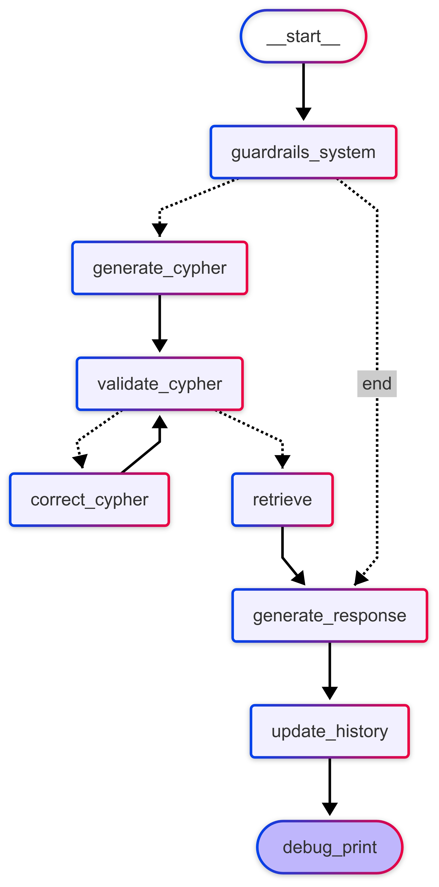

# ml-grafwiedzy

## Opis

Ten projekt wykorzystuje `pyproject.toml` oraz `Poetry` do zarządzania zależnościami i środowiskiem Pythona.

## Wymagania

- Python 3.10+
- Poetry

## Instalacja Poetry

Jeśli nie masz zainstalowanego Poetry, możesz to zrobić za pomocą poniższego polecenia:

```sh
curl -sSL https://install.python-poetry.org | python3 -
```

## Jak używać?

### Instalacja zależności

Po sklonowaniu repozytorium przejdź do katalogu projektu i uruchom:

```sh
poetry install
```

### Uruchamianie środowiska wirtualnego

Aby uruchomić interaktywne środowisko wirtualne, użyj:

```sh
poetry shell
```

### Dodawanie zależności

Aby dodać nową zależność do projektu, użyj:

```sh
poetry add <nazwa_pakietu>
```

Przykład:

```sh
poetry add numpy
```

### Uruchamianie skryptów

Jeśli masz plik `main.py`, możesz go uruchomić bezpośrednio przez Poetry:

```sh
poetry run python main.py
```


### Jak odpalic RAGa ? 
Stwórz plik .env w folderze głównym i wklej klucz api do deepseeka, i cridentiale neo4j :
```
DEEPSEEK_API_KEY=
NEO4J_URI=
NEO4J_USERNAME=
NEO4J_PASSWORD=
```
Następnie zainstaluj paczki poetrowe 
```bash
poetry install 
```

I wywołaj RAGa 
```bash
poetry run rag
```


## Struktura projektu

- pyproject.toml: Główna konfiguracja projektu, w tym zależności, narzędzia do formatowania i inne ustawienia.
- README.md: Dokumentacja projektu.
- src/: Folder zawierający kod źródłowy projektu.

## Diagram systemu RAG
